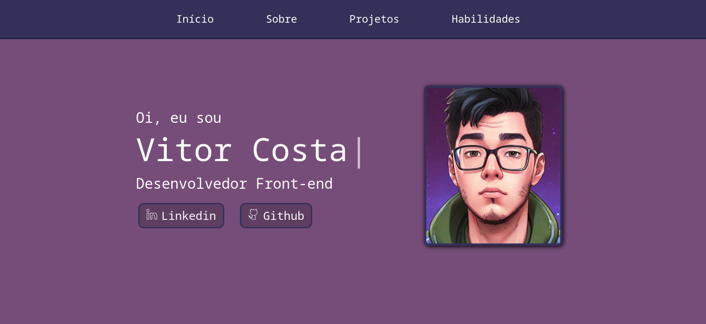

<h1><a href="https://vitorcosta.vercel.app/" >Portfólio - Vitor Costa</a></h1>

  
  
  

<h2>Descrição</h2>

Meu portfólio foi criado com o propósito de oferecer aos visitantes a oportunidade de explorar meus trabalhos e habilidades como desenvolvedor. Utilizando tecnologias modernas e atualizadas, o projeto é uma representação fiel de minha experiência e habilidades técnicas. Seja bem-vindo para conhecer mais sobre mim e meu trabalho por meio deste portfólio.

<a href="https://www.figma.com/file/Cwf2mgccPUxKT0qeG4Qaft/Portfolio?type=design&node-id=0%3A1&mode=design&t=esbwy8zzBuFlwj8o-1">Clique aqui para ver o design do projeto</a>

Ps: Apenas a tela inicial foi projetada utilizando o Figma, as demais partiram unicamente do conhecimento de UI e UX do autor, juntamente ao CSS e a ferramenta de estilização Styled Components.

<a href="https://www.vitorcosta.vercel.app/">Para visualizar o projeto em seu navegador, clique aqui.

</a>

<h2>Como utilizar</h2>

<h3>1. Clone o repositório:</h3>
<pre>
  <code>
    git clone https://github.com/vitorcosta42/Portfolio
  </code>
</pre>

<h3>2. Entre no repositório clonado e instale as dependências:</h3>
<pre>
  <code>
    npm install
  </code>
</pre>

<h3>3. Inicie o servidor React</h3>
<pre>
  <code>
    npm start
  </code>
</pre>

Após realizar esta sequência de passos a aplicação já estará pronta para ser utilizada 

<h2>Créditos</h2>
<table>
  <tr>
    <td align="center">
      <a href="https://github.com/vitorcosta42">
         
        
          <b>Vitor Costa</b>
        
      </a>
    </td>
  </tr>
</table>

<h2>Licença</h2>
<b>All Rights Reserved</b>
